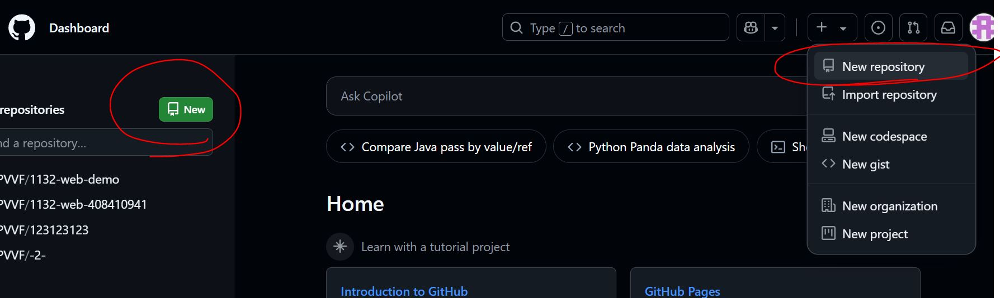
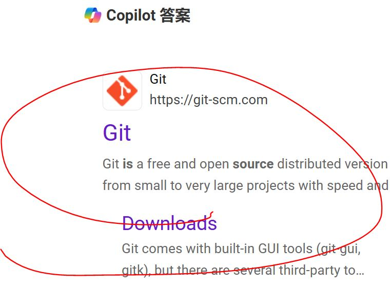
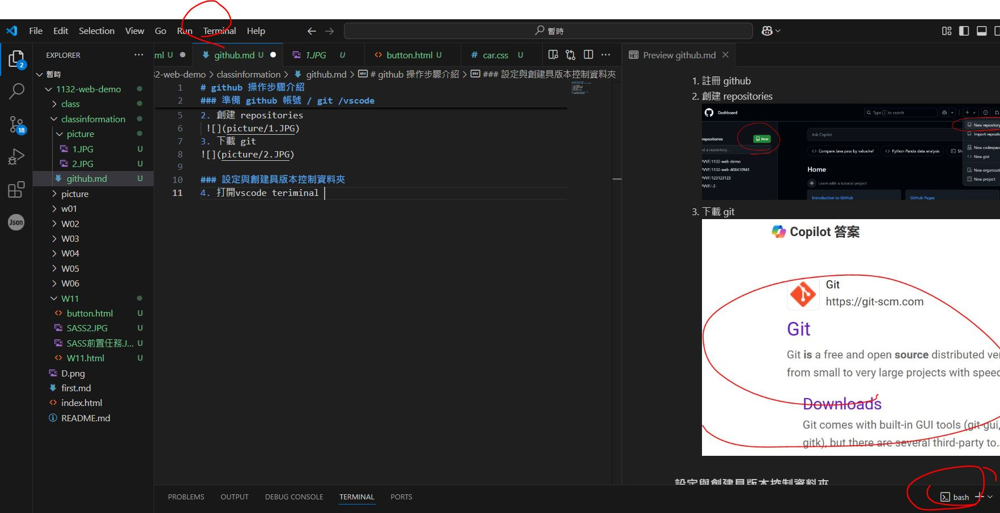
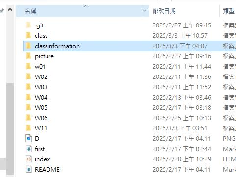
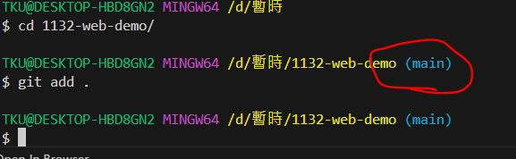
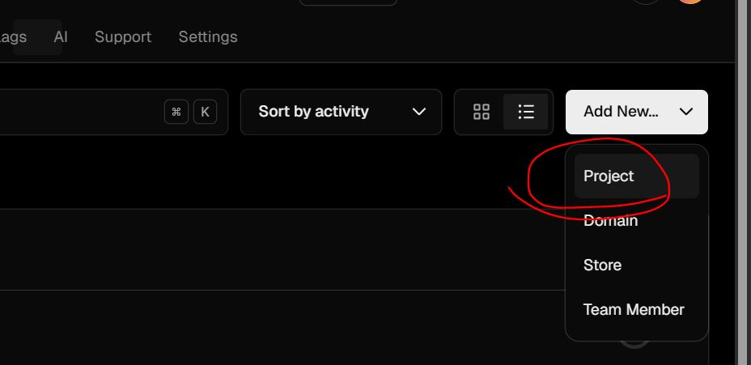
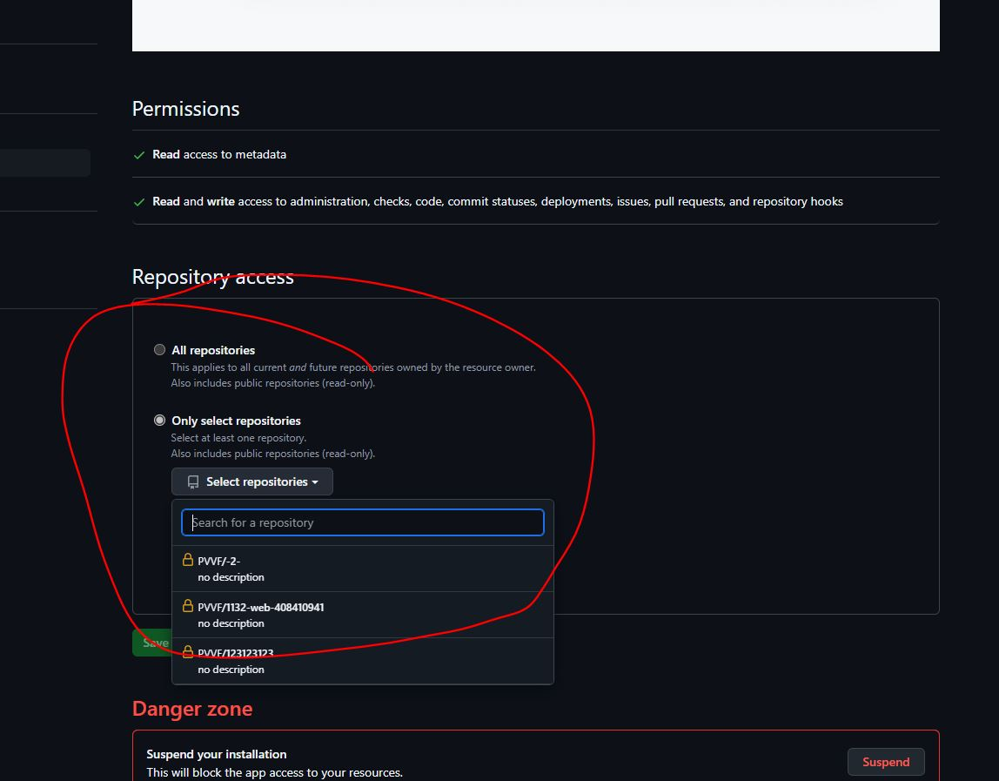
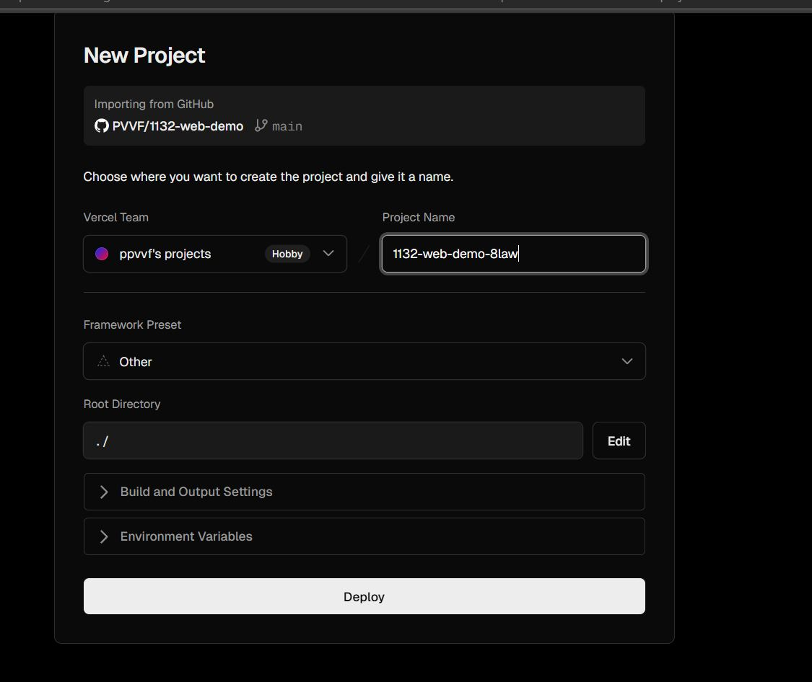
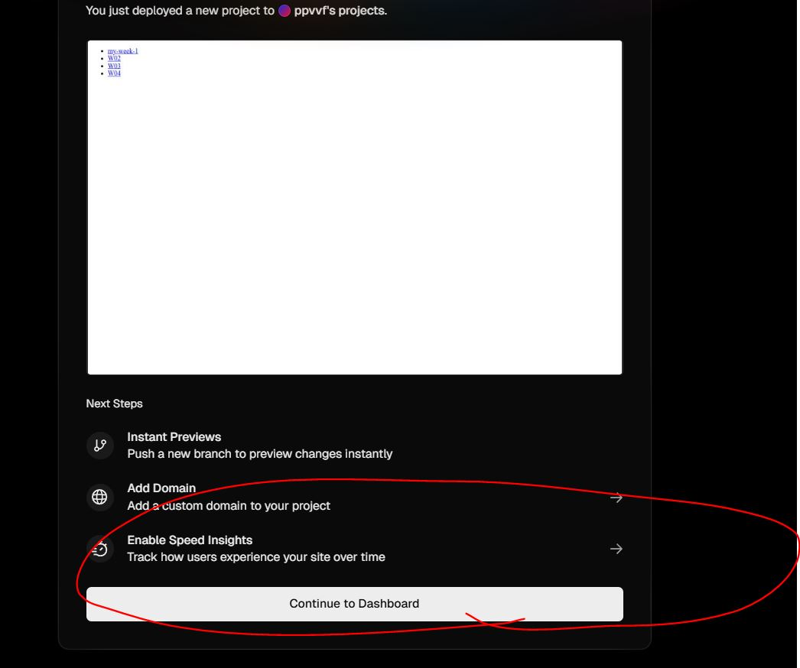
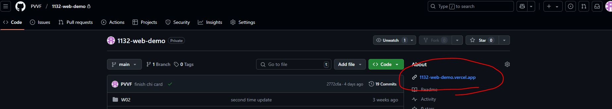

# github 操作步驟介紹
### 準備 github 帳號 / git /vscode

1. 註冊 github
2. 創建 repositories 
 
3. 下載 git  
 

### 設定與創建具版本控制資料夾
4. 打開vscode teriminal 啟用 git bash

5. 指令 : 複製 repository 下來
```
git clone "your_github_repository_link"
```
6. 確認成功完成，檢查資料夾有.git檔表示具版控


### 上傳github 

7. 前往main資料夾

更新檔案資訊於暫存區域
```
git add .
```

8. **首次** 上傳需要設定上傳之帳戶郵箱與github 名稱
```
  git config --global user.email "you@example.com"
  git config --global user.name "Your_Name_in_github " 
```
9. 撰寫上傳訊息
```
git commit -m "message_for_update"
```
10. 上傳
```
git push
```

### 其他 LF will be replaced by CRLF the next time Git touches it
如果你在跨平台開發（例如在 Windows 和 Unix/Linux 之間切換），設置 Git 將行尾符號統一為 LF：
git config --global core.autocrlf input 


## 後續使用--將本地資料同步更新至獻上最新版本
```
git pull 
```

## 將網站架至 vercel 
1. 註冊vercel (用github 可)
2. 登入
3. add new project

4. add github account//連結github
5. select respository

6. import

7. **Congratulations!**

8. github 也會出現連結


**它預設會執行在root 裡面 index.html** 